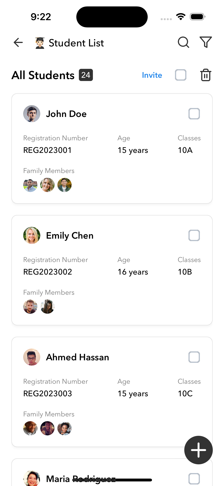
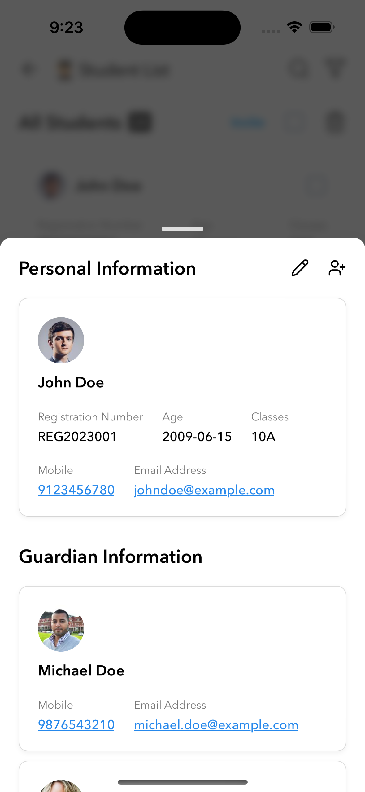
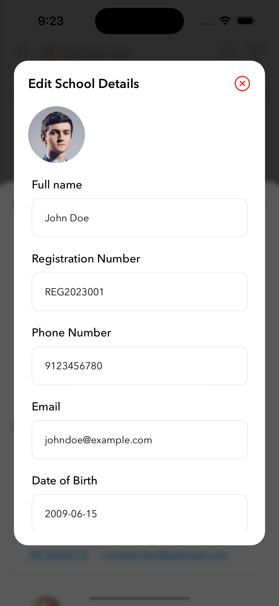
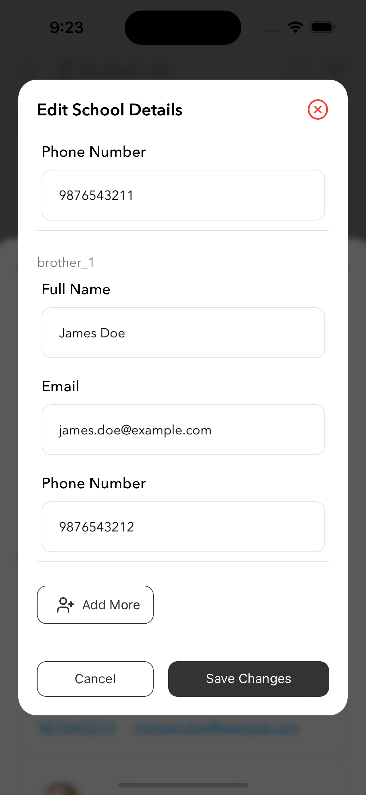
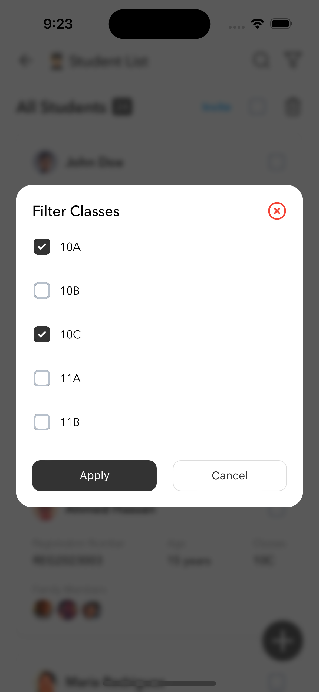
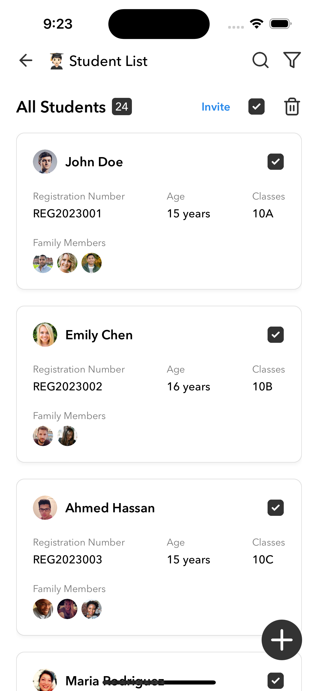

# 📚 Student Management App

Welcome to the **Student Management App** – your go-to solution for managing student information efficiently! This React Native application provides features to view, create, edit, and filter student lists seamlessly, all while maintaining a clean and intuitive interface.

---

## ✨ Key Features

- 📋 **Student List Management**: View a detailed list of students with attributes like name, class, age, registration number, and more.
- 🔍 **Search & Filter**: Search students by name and filter by class for better navigation.
- ✏️ **Edit Student Details**: Update student information directly from the app using a sleek modal.
- ➕ **Add New Students**: Dynamically add students to the list for real-time updates.
- 🗑️ **Delete Students**: Remove students from the list individually or in bulk.
- 📊 **Data Overview**: Comprehensive display of student data, including guardians and profile pictures.

---

## 🖼️ App Preview
|  |  |  |
|----------------------------------------|----------------------------------------|----------------------------------------|
|  |  |  |


---

## 🚀 Getting Started

Follow these steps to set up the app on your local machine.

### Prerequisites

Ensure you have the following installed on your system:

- 🖥️ Node.js (>= 23.x)
- 📱 React Native CLI
- 💻 Android Studio or Xcode (for device emulation)

### Installation

1. Clone the repository:
   ```bash
   git clone https://github.com/DhirajsGithub/Edu-lab
   cd Edu-lab
   ```
2. Install the dependencies:
   ```bash
   npm install
   ```
3. Install pods (for iOS):
   ```bash
   cd ios && pod install && cd ..
   ```
### Run the app:
3. For Android:
   ```bash
   npx react-native run-android
   ```
4. For iOS:
   ```bash
   npx react-native run-ios
   ```

